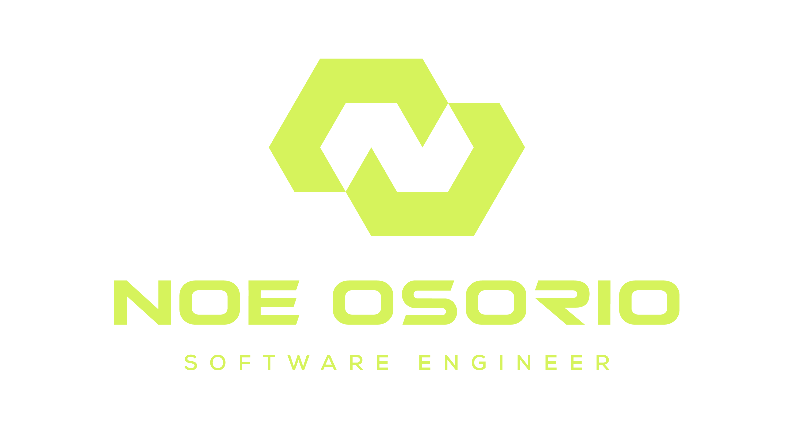

<div align="center">

# Audio Transcriber and Script Generator

Este programa procesa archivos de audio, permitiéndote transcribirlos, crear scripts cinematográficos basados en la transcripción y extraer los puntos clave de una reunión, evento o video largo.




</div>

## Características

- **Transcripción de audio**: Transcribe archivos de audio en texto utilizando la API de OpenAI.
- **Creación de scripts**: Genera scripts cinematográficos basados en la transcripción, con un tono y duración específicos.
- **Extracción de puntos clave**: Extrae los puntos clave de un archivo de audio o video y los resume de forma profesional.

## Requisitos

- **Python 3.7 o superior**
- **Paquetes necesarios**:
  - `openai`
  - `pydub`
  - `dotenv`
  - `tqdm`
  
  Instala los requisitos con el siguiente comando:
  ```bash
  pip install openai pydub python-dotenv tqdm
  ```

## Configuración

1. **API Key de OpenAI**: Crea un archivo `.env` en el directorio del proyecto con las siguientes variables de entorno:

    ```
    OPENAI_ORGANIZATION=your_openai_organization
    OPENAI_PROYJECT=your_openai_project
    OPENAI_API_KEY=your_openai_api_key
    ```

2. **Estructura de carpetas**: El programa espera que los archivos de audio se almacenen en una carpeta llamada `voice_notes/`, que los segmentos de audio se guarden en `segments_audio/`, y que los archivos transcritos y generados se guarden en `transcriptions/` y `ai_text_notes/`. Estas carpetas se crearán automáticamente si no existen.

## Uso

El programa puede ejecutarse desde la línea de comandos utilizando diferentes argumentos para controlar las funcionalidades:

### Opciones de la línea de comandos

| Opción            | Descripción                                                             |
|-------------------|-------------------------------------------------------------------------|
| `--transcript`     | Realiza solo la transcripción del archivo de audio.                    |
| `--script`         | Genera solo el script basado en una transcripción existente.           |
| `--keypoints`      | Extrae los puntos clave del archivo de audio.                          |
| `--tone`           | Define el tono del script generado. Ejemplo: Inspirador, Motivacional. |
| `--audio`          | Nombre del archivo de audio (sin la extensión).                        |
| `--duracion`       | Define la duración aproximada del script en minutos.                   |

### Selección Interactiva sin Argumentos

Además de utilizar las opciones de línea de comandos, ahora puedes ejecutar el programa sin ninguna etiqueta (flag), y este te guiará de forma interactiva para seleccionar:

1. El archivo de audio que deseas procesar, mostrando los archivos disponibles en la carpeta `voice_notes/`.
2. Las acciones que deseas realizar (transcripción, generar script o extraer puntos clave), con un menú interactivo donde puedes seleccionar una o varias opciones.

Esta funcionalidad es útil cuando prefieres no especificar las opciones manualmente en la línea de comandos.

### Ejemplos de Uso

#### 1. **Solo transcripción de audio**

Transcribe un archivo de audio llamado `mi_audio.m4a` y guarda la transcripción en la carpeta `transcriptions/`:
```bash
python main.py --audio "mi_audio" --transcript
```

#### 2. **Crear un script cinematográfico basado en una transcripción**

Genera un script cinematográfico con un tono "Inspirador" y una duración aproximada de 5 minutos:
```bash
python main.py --audio "mi_audio" --script --tone "Inspirador" --duracion 5
```

#### 3. **Transcribir audio y crear un script automáticamente**

Transcribe el archivo de audio y, luego, genera un script basado en la transcripción:
```bash
python main.py --audio "mi_audio"
```

#### 4. **Extraer puntos clave de la transcripción**

Transcribe el archivo de audio y extrae los puntos clave:
```bash
python main.py --audio "mi_audio" --keypoints
```

#### 5. **Transcribir, generar script y extraer puntos clave**

Ejecuta todo el flujo: transcribir el audio, generar un script y extraer los puntos clave:
```bash
python main.py --audio "mi_audio" --keypoints --tone "Motivacional" --duracion 10
```

### Ejemplo de Uso Sin Argumentos

Si prefieres no utilizar etiquetas, puedes ejecutar el siguiente comando:
```bash
python main.py
```

Esto te permitirá seleccionar el archivo de audio y las acciones a realizar de forma interactiva.

## Estructura de Archivos

- **voice_notes/**: Aquí debes colocar los archivos de audio (e.g. `mi_audio.m4a`).
- **transcriptions/**: Aquí se guardan las transcripciones de los audios.
- **ai_text_notes/**: Aquí se guardan los scripts generados por AI.
- **keypoints/**: Aquí se guardan los puntos clave extraídos de las transcripciones.

## Optimización

Si el archivo de transcripción o el script ya existen, el programa omitirá su creación para ahorrar recursos, a menos que se especifique explícitamente con `--transcript` o `--script`.

## Instalación del Entorno Virtual

Para configurar el entorno virtual y los paquetes necesarios, ejecuta el script `setup.sh`:

```bash
./setup.sh
```

Este script creará y activará un entorno virtual, y luego instalará las dependencias listadas en `requirements.txt`.

## Contribuciones

Si deseas contribuir al proyecto, puedes enviar un pull request o crear un issue en el repositorio.
